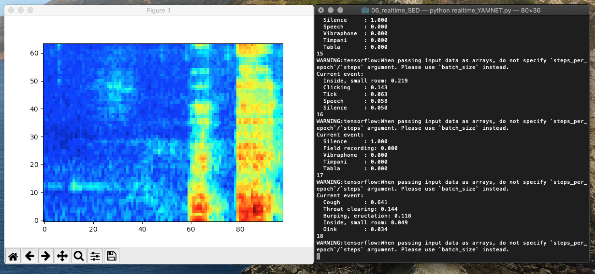

# 🎤 Real-time YAMNet Sound Event Detector

A real-time sound classification system using Google's YAMNet model that can detect and classify **521 different audio events** from your microphone in real-time. Optimized for both CPU and GPU (NVIDIA) acceleration.



## ✨ Features

- 🎯 **521 Audio Event Classes** - Detects speech, music, animals, vehicles, household sounds, nature, alarms, and more
- ⚡ **Real-time Processing** - Analyzes audio every second
- 🖥️ **GPU Acceleration** - Optimized for NVIDIA GPUs with CUDA support (5-10x speedup)
- 📊 **Visual Feedback** - Real-time mel-spectrogram visualization
- 🎤 **Automatic Mic Setup** - Built-in microphone configuration and troubleshooting
- 🚀 **Easy Deployment** - One-command setup for local machines or clusters

## 🚀 Quick Start

### Installation

```bash
git clone https://github.com/MazharZiadeh/realtime_YAMNET.git
cd realtime_YAMNET
bash setup.sh
```

### Running

**CPU Mode:**
```bash
bash run.sh
```

**GPU Mode (5-10x faster):**
```bash
bash run_with_gpu.sh
```

### Output Example

```
Current event:
  Speech      : 0.847
  Inside      : 0.523
  Conversation: 0.412
  Music       : 0.234
  Background  : 0.156
```

## 📊 Detectable Sound Events (521 Classes)

| Category | Examples |
|----------|----------|
| 🗣️ **Speech** | Conversation, laughter, shouting, whispering, singing |
| 🎵 **Music** | Instruments, genres, singing, melodies |
| 🐕 **Animals** | Dogs, cats, birds, insects, wildlife |
| 🚗 **Vehicles** | Cars, trains, airplanes, motorcycles |
| 🏠 **Household** | Doors, appliances, tools, phone rings |
| 🌳 **Nature** | Wind, rain, thunder, water, rustling |
| 🔔 **Alerts** | Alarms, bells, sirens, buzzers |

[Full list of 521 classes](yamnet/yamnet_class_map.csv)

## 🖥️ Deployment

### Local Machine
```bash
bash setup.sh && bash run.sh
```

### Remote Server / Cluster
```bash
scp -r realtime_YAMNET user@server:/path/
ssh user@server
cd /path/realtime_YAMNET
bash setup.sh
bash run_with_gpu.sh
```

### Docker
```bash
docker build -t realtime-yamnet .
docker run -it --rm --device /dev/snd realtime-yamnet
```

### SLURM GPU Cluster
```bash
sbatch deploy/slurm_job.sh
```

See [DEPLOYMENT.md](DEPLOYMENT.md) for detailed deployment instructions.

## 🔧 Troubleshooting

### Microphone Not Working
```bash
bash fix_microphone.sh
```

### PyAudio Installation Issues
**Ubuntu/Debian:**
```bash
sudo apt-get install portaudio19-dev python3-dev
```

**macOS:**
```bash
brew install portaudio
```

See [MICROPHONE_FIXED.md](MICROPHONE_FIXED.md) for detailed troubleshooting.

## 📁 Project Structure

```
realtime_YAMNET/
├── realtime_YAMNET.py          # Main application (with GUI)
├── realtime_YAMNET_text.py     # Text-only version
├── yamnet/                     # YAMNet model files
│   ├── yamnet.h5              # Pretrained weights (15MB)
│   └── yamnet_class_map.csv   # 521 class labels
├── setup.sh                    # Setup script
├── run.sh                      # CPU execution
├── run_with_gpu.sh            # GPU execution
├── fix_microphone.sh          # Mic troubleshooting
├── Dockerfile                  # Docker image
├── deploy/                     # Deployment scripts
│   └── slurm_job.sh           # SLURM job script
└── requirements.txt           # Dependencies
```

## 🔬 Technical Details

- **Model**: YAMNet (MobileNetV1-based)
- **Input**: 16kHz mono audio, 0.96s frames
- **Output**: 521-class probability distribution
- **Latency**: ~50ms (GPU) / ~200ms (CPU)

## 📄 License

MIT License - see [LICENSE](LICENSE) file

## 🙏 Acknowledgments

- **Original Project**: [SangwonSUH/realtime_YAMNET](https://github.com/SangwonSUH/realtime_YAMNET)
- **YAMNet Model**: [Google Research - AudioSet](https://github.com/tensorflow/models/tree/master/research/audioset/yamnet)

## 📚 Documentation

- [Quick Start Guide](QUICKSTART.md)
- [Setup Guide](SETUP.md)
- [Deployment Guide](DEPLOYMENT.md)
- [GPU Setup](GPU_SETUP_COMPLETE.md)
- [Microphone Fix](MICROPHONE_FIXED.md)

---

**Made with ❤️ for the audio ML community**

